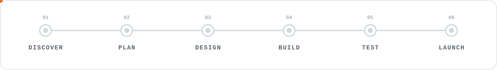

<!-- Omar Faruk · GitHub profile · assets live in /assets, snake is built by .github/workflows/snake.yml -->

<div align="center">

<picture>
  <source media="(prefers-color-scheme: dark)" srcset="assets/hero-dark.svg">
  <source media="(prefers-color-scheme: light)" srcset="assets/hero-light.svg">
  
</picture>

<br><br>

<a href="https://omarforge.com"></a>&nbsp;
<a href="https://omarforge.com"></a>&nbsp;
<a href="YOUR_LINKEDIN_URL"></a>

</div>

<br>

## { ★ } PROFILE

```text
ROLE      Product Designer + Developer
BUILDING  Mobile • Web • Shopify
FOCUS     Clear UX • Useful Products
MODE      Design → Build → Launch
STATUS    ● Open to new projects
```

## { ● } WHAT DO YOU NEED?

<sub>Click one to open it.</sub>

<details>
<summary><b>01 — I need a product designed</b></summary>
<br>

User flows, wireframes, interfaces, prototypes, design systems and developer handoff.

```text
YOU GET   Flows → Wireframes → Hi-fi UI → Prototype → Handoff
TOOLS     Figma · UX research · Design systems
```

</details>

<details>
<summary><b>02 — I need a mobile app built</b></summary>
<br>

Flutter apps from first screen to store release: API integration, testing, debugging and release support.

```text
YOU GET   One codebase for Android + iOS, tested and release-ready
TOOLS     Flutter · Dart · REST APIs
```

</details>

<details>
<summary><b>03 — I need a website or Shopify store</b></summary>
<br>

Websites, web apps, dashboards, responsive layouts, Shopify stores and integrations.

```text
YOU GET   Fast, responsive pages that are easy to update
TOOLS     JavaScript · HTML · CSS · Tailwind · Shopify
```

</details>

<details>
<summary><b>04 — My app already exists, but it's broken or messy</b></summary>
<br>

Fixes for existing products and AI-built apps: UI issues, bugs, responsive problems and cleanup.

```text
YOU GET   A list of what's wrong, then the fixes — no rebuild unless it's needed
```

</details>

<details>
<summary><b>05 — I want to automate something</b></summary>
<br>

Browser tools, API connections, internal utilities and workflow automation.

```text
YOU GET   Small tools that save hours every week
```

</details>

## { ★ } WORKFLOW

<picture>
  <source media="(prefers-color-scheme: dark)" srcset="assets/workflow-dark.svg">
  <source media="(prefers-color-scheme: light)" srcset="assets/workflow-light.svg">
  
</picture>

I like staying close to the whole product lifecycle instead of stopping after the screens are designed.

## { ● } STACK

<picture>
  <source media="(prefers-color-scheme: dark)" srcset="assets/stack-dark.svg">
  <source media="(prefers-color-scheme: light)" srcset="assets/stack-light.svg">
  
</picture>

## { ★ } CURRENT FOCUS

```diff
+ Product design
+ Flutter apps
+ Web products
+ Shopify development
+ AI-built product improvements
+ Browser tools & automation
```

## { ● } CONTRIBUTIONS

<picture>
  <source media="(prefers-color-scheme: dark)" srcset="https://raw.githubusercontent.com/Omars-dev/Omars-dev/output/github-snake-dark.svg">
  <source media="(prefers-color-scheme: light)" srcset="https://raw.githubusercontent.com/Omars-dev/Omars-dev/output/github-snake.svg">
  
</picture>

## { ★ } OMAR FORGE

**Product Design & Development** — build new, improve existing.

<a href="https://omarforge.com"></a>

<br>

<picture>
  <source media="(prefers-color-scheme: dark)" srcset="assets/footer-dark.svg">
  <source media="(prefers-color-scheme: light)" srcset="assets/footer-light.svg">
  
</picture>
